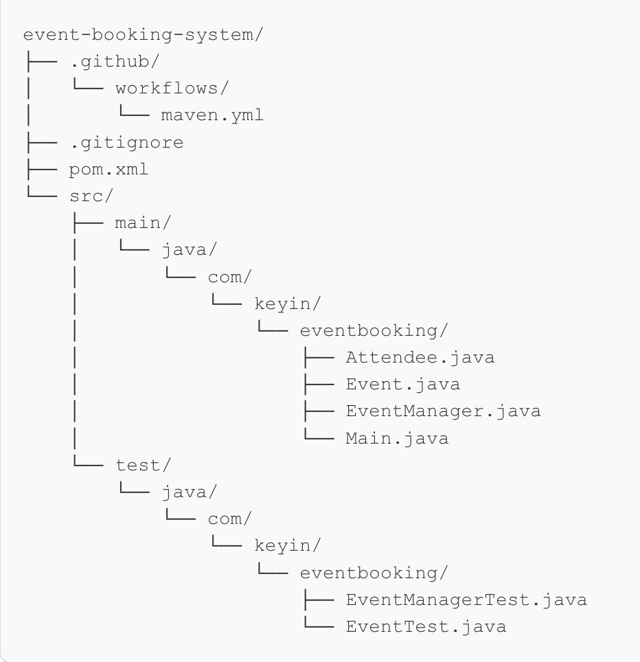
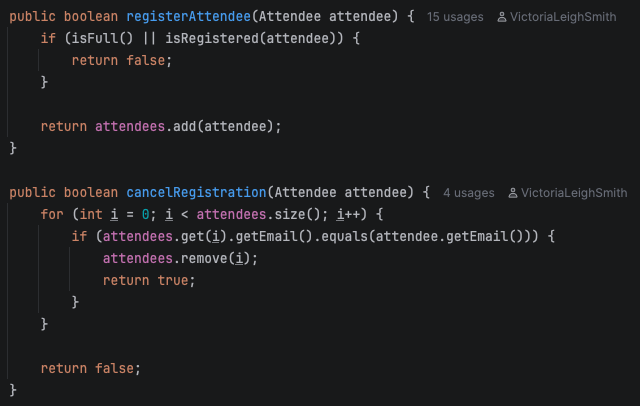
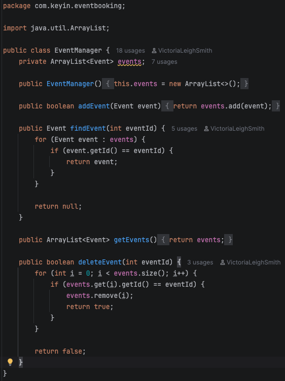
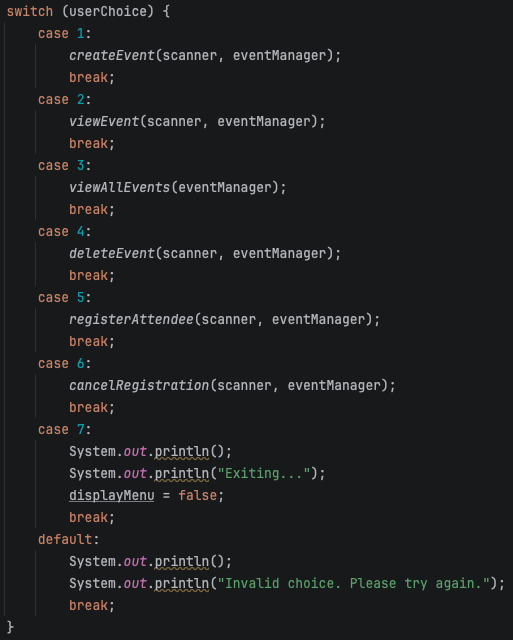
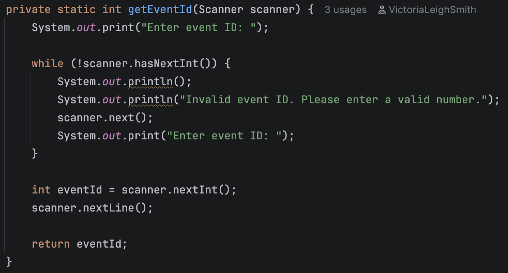

# Event Booking System

## Project Overview

The Event Booking System is a Java-based console app that allows users to create and manage events. Users can create an event with a name, date, and attendee capacity. A user can also view a single event or all events, delete existing events, register attendees, and cancel attendee registration.

This application was developed using OOP principles and clean code practices. The app separates event management, event registration logic, attendee information, and user console interaction into different classes.

## Features

- Create an event with a name, date and capacity
- Automatically assign an auto-incrementing ID to events
- View individual events by ID
- View all events
- Delete events
- Register attendees for events
- Prevent duplicate attendee registration by checking existing attendee email addresses
- Block attendee registration if event is at capacity
- Cancel attendee registration
- Display available spots for events
- Validate event dates, capacity, and user input

## Project Structure

- **Attendee** represents an event attendee and stores their name and email
- **Event** represents an event and stores its name, date, and capacity, as well as handling attendee registration, cancellation, and available spots.
- **EventManager** manages the collection of events and adding, finding and deleting them
- **Main** handles user input via a console menu and connects user actions to the appropriate logic

## How the Application Works

When the app starts, the user will be presented with a menu where they can create events, view or delete events, register or cancel attendee registration.

Each event is automatically assigned a unique ID and stored by the EventManager. The ID is used to view and manage specific events. 

The Event class handles attendee registration and cancellation, and ensures that duplicate attendee registration is prevented. The Event class also blocks registration to events once they've reached capacity.

The menu will continue to be displayed to the user until they choose to exit.

## Unit Testing

This project includes 14 total unit tests using JUnit, which are separated into 9 tests for the Event class and 5 tests for the EventManager class. Tests included are both positive and negative to make sure that the main app logic is covered and working as intended.

The tests cover:

- Event capacity and available spots
- Attendee registration (successful and unsuccessful)
- Preventing duplicate registration and registration when event is at capacity
- Registration cancellation (successful and unsuccessful)
- Ensuring attendee is removed from event after cancellation
- Adding events to the EventManager
- Finding events by ID, and ensuring no events are found when they do not exist
- Event deletion (successful and unsuccessful)

## Github Actions

GitHub Actions is configured to automatically build the project and run all 14 unit tests whenever a pull request is opened or updated against the main branch.

## Clean Code Examples

### Separation of Responsibilities

The application separates responsibilities between classes. For example, EventManager handles adding, finding, and deleting events, while Event handles attendee registration and cancellation. Main handles the console menu and user input, and Attendee stores attendee information. This keeps each class focused on a specific purpose.

**Event** - Attendee registration and cancellation

**EventManager** - Managing the collection of events

### Small Descriptive Methods

In Main, the console menu uses smaller methods with descriptive names for each user action, such as viewEvent(), createEvent(), and registerAttendee(). This keeps the main menu simple and easy to read, while keeping the purpose of each method clear.

### Avoiding Repeated Code

Repeated code was moved into small helper methods where possible. For example, getEventId() handles the event ID input and validation and is used in multiple menu options instead of repeating the same code in multiple scenarios.

## Dependencies

The project uses JUnit for unit testing, which is included as a dependency in the Maven `pom.xml` file and was obtained through the Maven repository.

## Challenges Encountered

Development went fairly smoothly overall, with no significant technical issues encountered. As the application grew, I made some adjustments to the code structure to improve readability and reduce repetition.

